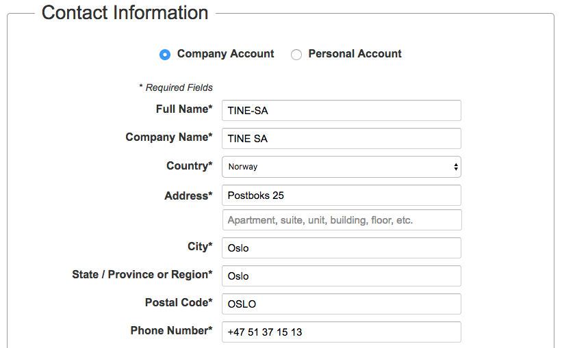

# Master account

This account is setup as the main account and is the root account for the AWS
organization structure.

This account has been created using the following details. .

The bootstrapping of the account has been done using the CLI, but these manual
steps have been performed in the GUI

**Manual steps in master account**

| Action   | Comment    |
| :------------- | :------------- |
| Updated IAM access to Billing and Cost management console | http://docs.aws.amazon.com/awsaccountbilling/latest/aboutv2/grantaccess.html |
| Activated cost allocation tags | Needs to be updated when tags exists |

See [bootstrap README](../bootstrap/README.md) for instructions on setting up an
account.

After these manual steps the following commands have been created and run in
scripts.

## CloudFormation templates for master only

### IAM:Role ReadOnly (iam/roles/readonly.\*)

# Additional Account setup

Where output is given from commands (not from stack, use describe-stack instead
to get info), the output is captured in files named "\*-output.json".

* __organization__ : Sets up the AWS organization and automating creation of the
  member accounts.

### Scripts to run for account creation

**Important** Users are required to have a valid and unique email account before
starting the account creation.

All commands have been first run with `--generate-cli-skeleton` to create the
input param skeleton as a json file.

* __createAccount.sh__: Creates a new account the automatically becomes a member
  of the organization.

After running the createAccount.sh script, you can run `aws organizations
list-create-account-status --profile masterbootstrap` to check the status.

When created, you must check the email address for the account to complete the
setup. Meaning: You have to request a password change to set the root password
for the account.

Run `aws organizations describe-create-account-status
--create-account-request-id <request-id> --profile masterbootstrap` to get the
accountId of the new account. Use this id in the move-account config.

* __moveAccount.sh__: Moves the account to Husdyrfag OU in the organizations
  hierarchy.


Assume role to complete account setup

```
aws sts assume-role --role-arn arn:aws:iam::119826691357:role/OrganizationAccountAccessRole --role-session-name orgAdminAtHusdyrfagStaging --profile admin@tinesa
```

Create a CLI profile based on the output, so in the credentials file:
```
[OrganizationAccountAccessRole@hfdev]
aws_access_key_id = <id>
aws_secret_access_key = <key>
aws_session_token = <token>
```

In the config file:

```
[profile OrganizationAccountAccessRole@hfdev]
output = json
region = eu-west-1
```


* __bootstrap/iam/passwordPolicy__: Organizational password policy applied
* __bootstrap/iam/roles/cloudformation/cloudformation-<account>.json__: Created
  the CloudFormation role *that should be used when creating further CF
  resources*. This was run using the "accountbootstrap" profile.
* __bootstrap/iam/policies/forceMfa/forceMfa-<account>.json__: Creates the
  ForceMFA policy that all accounts should have.

# Remember

Activation of cost allocation tags must be done after the tags exists.
